# NanoTekSpice
  
> The first goal of this project is to create a program capable of simulating the behavior of electronic components in C++. This project is designed to challenge our project architecture.

## Table of content
1. [Usage](#usage)
2. [Project Architecture](#project--architecture)
3. [Contributors](#contributors)

### Usage

### Project Architecture

```mermaid
---
title: NanoTekSpice Architecture
---
classDiagram
    namespace nts {
        class IComponent{
            <<Interface>>
            + ~IComponent()*
            + simulate(std::size_t tick) void*
            + compute(std::size_t tick) Tristate*
            + setLink(std::size_t pin, IComponent &other, std::size_t otherPin, bool isPassed) void*
            + &operator=(const Tristate &state) IComponent*
        }

        class Tristate {
            <<Enumeration>>
            +Undefined
            +True
            +False
        }
    }

    class Shell {
        <<Class>>
        +Shell()
        +Shell(const Shell &obj)
        +~Shell()
        +run(const std::string file) void
        +comupteComponents() void
        +operator=(const Shell &obj) Shell &
        -CircuitComponent _mainCircuit
    }
    
    class AComponent  {
        <<Abstract>>
        # AComponent()
        # ~AComponent()
        +compute(std::size_t tick) nts::Tristate*
        +override simulate(std::size_t tick) void
        +override setLink(std::size_t pin, IComponent &other, std::size_t otherPin, bool isPassed) void
        +override operator=(const nts::Tristate &state) AComponent &
        +class ComponentError
        #std::unordered_map~std::size_t : std::vector~nts::IComponent*~~ _links;
        #nts::Tristate _actualState;
        #std::size_t _tick;

    }

    class TrueComponent {
        <<Class>>
        +TrueComponent()
        +TrueComponent(const TrueComponent &obj)
        +~TrueComponent()
        +override compute(std::size_t tick) nts::Tristate
        +override operator=(const nts::Tristate &state) TrueComponent &
        +operator=(const TrueComponent &obj) TrueComponent &
    }
    class FalseComponent {
        <<Class>>
        +FalseComponent()
        +FalseComponent(const FalseComponent &obj)
        +~FalseComponent()
        +override compute(std::size_t tick) nts::Tristate
        +override operator=(const nts::Tristate &state) FalseComponent &
        +operator=(const FalseComponent &obj) FalseComponent &
    }

    class NandComponent {
        <<Class>>
        +NandComponent()
        +NandComponent(const NandComponent &obj)
        +~NandComponent()
        +override compute(std::size_t tick) nts::Tristate
        +override operator=(const nts::Tristate &state) NandComponent &
        +operator=(const NandComponent &obj) NandComponent &
    }

    class ClockComponent {
        <<Class>>
        +ClockComponent()
        +ClockComponent(const ClockComponent &obj)
        +~ClockComponent()
        +override compute(std::size_t tick) nts::Tristate
        +override simulate(std::size_t tick) void
        +override operator=(const nts::Tristate &state) ClockComponent &
        +operator=(const ClockComponent &obj) ClockComponent &
        -nts::Tristate _futurState
    }

    class InputComponent {
        <<Class>>
        +InputComponent()
        +InputComponent(const InputComponent &obj)
        +~InputComponent()
        +override compute(std::size_t tick) nts::Tristate
        +override simulate(std::size_t tick) void
        +override operator=(const nts::Tristate &state) InputComponent &
        +operator=(const InputComponent &obj) InputComponent &
        -nts::Tristate _futurState
    }

    class OutputComponent {
        <<Class>>
        +OutputComponent()
        +OutputComponent(const OutputComponent &obj)
        +~OutputComponent()
        +override compute(std::size_t tick) nts::Tristate
        +override operator=(const nts::Tristate &state) OutputComponent &
        +operator=(const OutputComponent &obj) OutputComponent &
    }

    class CircuitComponent {
        <<Class>>
        + CircuitComponent()
        + CircuitComponent(const CircuitComponent &obj)
        + CircuitComponent(std::string &component)
        + ~CircuitComponent()
        + getParser() Parsing
        + getTick() std::size_t
        + getMapComponent() std::unordered_map~std::string : std::shared_ptr~nts::IComponent~~
        + getMapLinks() std::unordered_map~std::string : std::size_t~
        + findComponent(const std::string name) std::shared_ptr~nts::IComponent~
        + getAtPin(std::size_t pin) nts::IComponent *.
        + addComponent(std::shared_ptr~nts::IComponent~ component, std::string name) void
        + fillCircuitComponent(std::string filename) void
        + display() void
        + override simulate(std::size_t tick) void
        + override operator=(const nts::Tristate &state) CircuitComponent &
        + operator=(const CircuitComponent &obj) CircuitComponent &
        -std::unordered_map~std::string : std::shared_ptr~nts::IComponent~~ _mapComponent
        -std::unordered_map~std::string : std::size_t~ _linkIndex
        -Parsing parser
    }

    class FactoryError {
        <<Nested Class>>
        +FactoryError(std::string msg)
        +~FactoryError()
        -const noexcept what() const char*.
        -std::string _msg
    }

    class ComponentFactory {
        <<Class>>
        +ComponentFactory()
        +ComponentFactory(const ComponentFactory &obj)
        +~ComponentFactory()
        +isMappedComponent(const std::string &type) bool
        +createComponent(const std::string &type) std::shared_ptr~nts::IComponent~
        +const getMap() std::unordered_map~std::string : std::function~std::shared_ptr~nts::IComponent~~~
        +operator=(const ComponentFactory &obj) ComponentFactory &
        +class FactoryError
        -std::unordered_map~std::string : std::function~std::shared_ptr~nts::IComponent~~~ _creationMap;
    }

    class Parsing {
        <<Class>>
        +Parsing()
        +Parsing(const Parsing &parsing)
        +~Parsing()
        +parsingFile(std::string fileName, std::unordered_map~std::string : std::shared_ptr~nts::IComponent~~ &_map, std::unordered_map~std::string : std::size_t~ &_linkIndex); void
        +parsingChipset(std::string ligne, std::unordered_map~std::string : std::shared_ptr~nts::IComponent~~ &_map,int nbr, std::unordered_map~std::string : std::size_t~ &_linkIndex); void
        +parsingLink(std::string ligne, std::unordered_map~std::string : std::shared_ptr~nts::IComponent~~ &_map); void
        +mapContain(std::string componentName, std::unordered_map~std::string : std::shared_ptr~nts::IComponent~~ &_map); bool
        +getInputs(); std::list~std::string~
        +getOutputs(); std::list~std::string~
        +operator=(const Parsing &object) Parsing &
        +class ParsingError
        #ComponentFactory _factory
        #std::list~std::string~ inputs
        #std::list~std::string~ outputs
    }

    class ParsingError {
        <<Nested Class>>
        +ParsingError(std::string msg)
        +~ParsingError()
        -const noexcept what() const char*.
        -std::string _msg
    }
    class ComponentError {
        <<Nested Class>>
        +ComponentError(std::string msg)
        +~ComponentError()
        -const noexcept what() const char*.
        -std::string _msg
    }

    class exception["std::exception"]{
        <<Class>>
    }

    class Main {
        <<Program Start>>
        Shell cmdManager
    }

    IComponent --|> AComponent
    AComponent --|> CircuitComponent
    AComponent --|> FalseComponent
    AComponent --|> TrueComponent
    AComponent --|> NandComponent
    AComponent --|> ClockComponent
    AComponent --|> InputComponent
    AComponent --|> OutputComponent
    AComponent --> ComponentError : contains
    ComponentFactory --> FactoryError : contains
    Parsing --> ParsingError : contains
    exception --|> ComponentError
    exception --|> FactoryError
    exception --|> ParsingError
    Shell --> CircuitComponent
    CircuitComponent --> Parsing
    Parsing --> ComponentFactory
    Main --> Shell
```

### Contributors

[LARGEOT Maxence](https://github.com/MaxenceLgt) 
[DORIEL Arthur](https://github.com/MrMarmotte)
